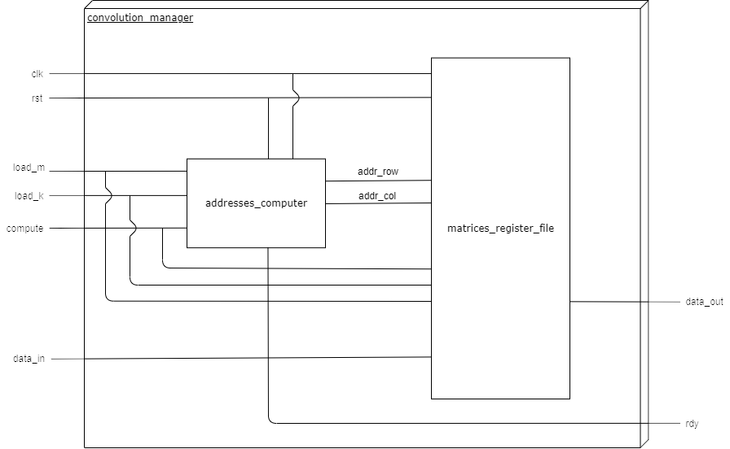

# matrix_convolution_vhdl

Module for performing matrix convolution of a 16x16 matrix and a 3x3 kernel, already provided inverted.\
Data are represented in unsigned fixed-point arithmetic (16.16 bit).\
1 padding of 0 and stride value of 1 are used, so that the output size will be 16x16.\
The module allows to:
* write the input matrix and the kernel (element by element using addressing)
* read the output matrix (data streaming when computing the convolution)
* trigger the computation
* reset matrices values

## Inner structure

## VHDL

The desired behaviour is obtained through the interaction of two entities, a FSM, to compute the addresses according to the current operation (matrix load, kernel load or convolution computation), and a register file, responsible also for the math. The input and output data are transferred in a serial way: each clock cycle, the correct matrix addresses are computed, and the correspondent operation is performed. If the load phase is selected, data is stored, otherwise, a specific term of the convolution is computed and sent to the output.\
The whole VHDL code can be found in the [VHDL](VHDL) directory.\
Both the developed architectures are written in the behavioral way, allowing more specific hardware implementations.

## Verification

The desired behavior has been implemented through a higher programming language: C.\
As it is possible to see in the attached program, the matrix and kernel init functions create random unsigned long numbers, store them in memory, convert them in binary and write these values in the files that will be provided as inputs to the VHDL testbench. Then, the computeConvolution function does the math and writes to an output file, and to the console, the resulting matrix. The choice of internally working with ulong numbers was driven by the fact that, to convert a double number into a fixed-point binary one with 16 bits of decimal part, a loss of precision was always seen and the result of the convolution between double values was different from the same convolution of the converted binary values. So, not to use pure binary digits, which are already used in the VHDL code, ulong type has been chosen.
It is possible to see the whole high-level code in the [Verification](Verification) directory.\
